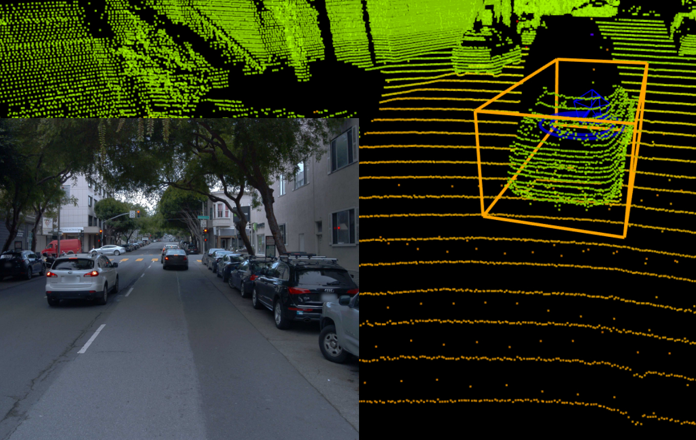
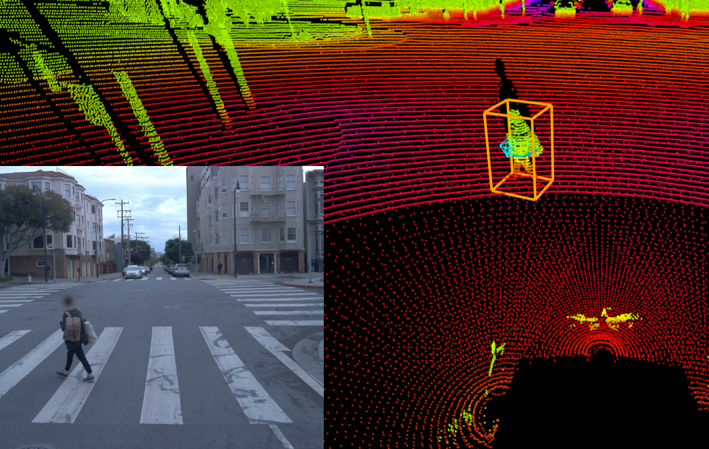
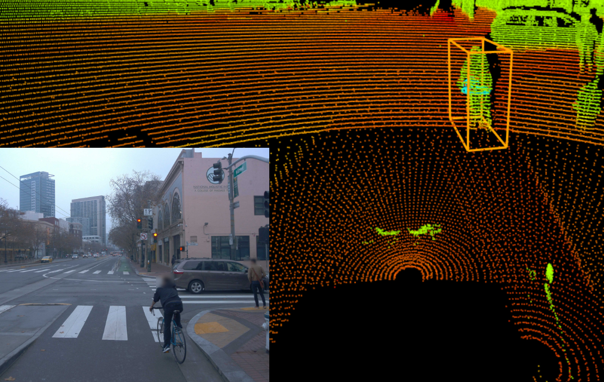
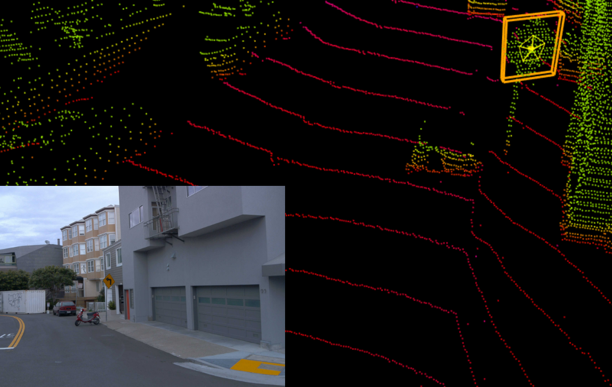
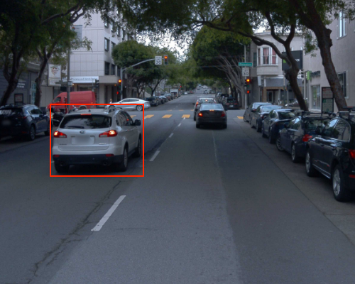
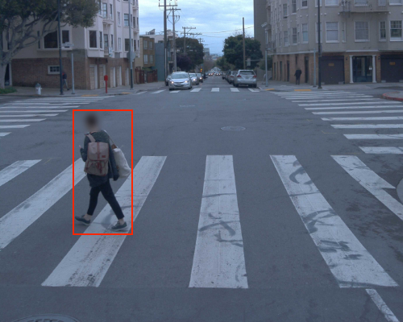
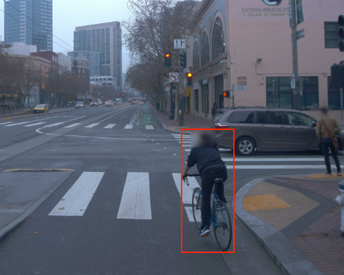

# Waymo Open Dataset Labeling Specifications

Copyright © 2019 Waymo LLC.

## 3D Labeling Specifications

### General Labeling Specifications

*   3D bounding boxes are drawn as tightly as possible around objects in lidar point clouds, and capture all visible parts of the object.
*   If an object is occluded and the data is insufficient to accurately draw the bounding box, bounding boxes are created on a best-effort basis.

#### Types of Labels

3D bounding boxes are included for vehicles, pedestrians, cyclists, and signs in the driving segments. Other objects are not labeled in this dataset.

#### No Label Zones

No Label Zones are created for areas that have little immediate relevance to the driving of the self-driving car or to other road users within the self-driving car's environment, such as the opposite side of a highway or a parking lot on the side of the road with a large number of vehicles.

### Vehicle Labeling Specifications

##### What is labeled

*   A vehicle bounding box is created if an object can be recognized as a vehicle, from either lidar data or camera images.
*   Trains and trams are not considered vehicles and are not labeled.
*   Motorcycles and motorcyclists are labeled as vehicles.

##### 3D bounding box drawing specifications

*   The bounding box includes:
    *   side mirrors, but excludes small protruding parts such as antenna, flag, trailer hitch, etc.
    *   objects protruding from the vehicle such as bike racks, extended ladder at the back of a truck, cargo box on the vehicle’s roof, etc.
    *   vehicle’s open hood/bonnet or trunk/boot
*   If a vehicle has any open doors (such as side doors, back doors or the gas tank lid), those are excluded from the bounding box.
*   For all vehicles with attached trailers, two separate bounding boxes are created: one for the vehicle/tractor and one for the trailer. Vehicles with trailers typically include station wagons, RVs, mobile homes, boats, tractor trailers, box trailers etc. If the vehicle and trailer have an overlap, then the bounding boxes can overlap as well.
*   Separate bounding boxes are created for all movable external attachments that are not a part of the main vehicle. Examples include hydraulic arms on construction vehicles and loading ramp on trucks.

##### Example

### Pedestrian Labeling Specifications

##### What is labeled

*   A pedestrian bounding box is created if an object can be recognized as a pedestrian, from either lidar data or camera images.
*   People who are walking or riding kick scooters (including electric kick scooters), segways, skateboards, etc. are labeled as pedestrians.
*   People inside other vehicles are not labeled, except for people standing on the top of cars/trucks or standing on flatbeds of trucks.
*   A person riding a bicycle is not labeled as a pedestrian, but labeled as a cyclist instead.
*   Mannequins, statues, dummies, objects covered with cloth covers, billboards, posters, pedestrians inside buildings, or reflections of people are not labeled.

##### 3D bounding box drawing specifications

*   A single bounding box (including the pedestrian and additional objects) is created if:
    *   the pedestrian is holding a small child or carrying small items (smaller than 2m in size such as umbrella or small handbag or a sign).
    *   the pedestrian is riding a kick scooter (including electric kick scooter), a segway, a skateboard, etc.
*   If the pedestrian is carrying an object larger than 2m, or pushing a bike or shopping cart, the bounding box does not include the additional object.
*   If the pedestrian is pushing a stroller with a child in it, separate bounding boxes are created for the pedestrian and the child. The stroller is not included in the child bounding box.
*   If pedestrians overlap each other, they are labeled as separate objects. If they overlap then the bounding boxes can overlap as well.

##### Example

### Cyclist Labeling Specifications

##### What is labeled

*   A cyclist bounding box is created if an object can be recognized as a cyclist, from either lidar data or camera images.
*   Bicycles that are parked or do not have a rider are not labeled.
*   When a pedestrian is getting onto a bicycle, they are labeled as pedestrian until they are about to get onto the bicycle, and labeled as cyclist after the rider gets into the riding position. Similarly, when a pedestrian is getting off of a bicycle, they are labeled as cyclist while the rider is in the riding position, and labeled as pedestrian once they start getting off the bicycle.
*   Bounding boxes are created for:
    *   a child riding a bicycle, tricycle or toy with wheels
    *   unicycles, tricycles, and recumbent bicycles
    *   large, multi-seat cyclists

##### 3D bounding box drawing specifications

*   The bounding box includes both the rider and the bicycle.
*   Objects attached to the rear of an active cyclist, such as seats and small trailers, are included in the bounding box.

##### Example

### Sign Labeling Specifications

##### What is labeled

*   A sign bounding box is created if an object is a sign that is used to regulate traffic flow (the sign subtype is not specified). Examples include: stop signs, yield signs, speed limit signs, warning signs, guide and recreation signs.
*   The following are not labeled:
  *   street name signs
  *   a paper sign / handwritten sign
  *   business boards
  *   any other signs that are not related to traffic

##### 3D bounding box drawing specifications

*   The bounding box size is created to be tightly fitting around the reflective data points, where the information about the sign is displayed
*   Lidar points from the pole or the base on which the sign is mounted are not included in the bounding box
*   The direction of the heading faces the side of the sign where information is displayed
*   When a sign has information on both sides, it is labeled as two different objects (with opposite headings)

##### Example

## 2D Labeling Specifications

### General Labeling Specifications

*   2D bounding boxes are drawn as tightly as possible around objects in the camera images, and capture all visible parts of the object.
*   The boxes only capture the visible parts of the object, and do not try to estimate the extent of a partially occluded object.
*   Parts of the self-driving car that are visible in the camera image and reflections are not labeled.
*   When there are too many objects at the horizon to label each one of them individually, labels are created only for the objects that can be labeled individually, and the remaining objects are ignored.

#### Types of Labels

2D bounding box labels are included for vehicles, pedestrians, and cyclists in the driving segments. Other objects are not labeled in this dataset.

#### Tracking Objects

A single track for each object is created for the duration of the video. When an object is entirely occluded in the middle of a track, it is marked as occluded for the part of the track when it is occluded.

### Vehicle Labeling Specifications

##### What is labeled

*   All objects that can be recognized as a vehicle and are at least partially visible are labeled.
*   If it is not possible to tell by looking at the camera image whether an object is a vehicle, the object is not labeled.
*   Trains and trams are not considered vehicles and are not labeled.
*   Motorcycles and motorcyclists are labeled as vehicles.

##### 2D bounding boxes drawing specifications

*   The bounding box includes:
    *   side mirrors, but excludes small protruding parts such as antenna, flag, trailer hitch, etc.
    *   objects protruding from the vehicle such as bike racks, extended ladder at the back of a truck, cargo box on the vehicle’s roof, etc.
    *   vehicle’s open hood/bonnet or trunk/boot
*   If a vehicle has any open doors (such as side doors, back doors or the gas tank lid), those are excluded from the bounding box.
*   For all vehicles with attached trailers, two separate bounding boxes are created: one for the vehicle/tractor and one for the trailer. Vehicles with trailers typically include station wagons, RVs, mobile homes, boats, tractor trailers, box trailers etc. If the vehicle and trailer have an overlap, then the bounding boxes can overlap as well.
*   Separate bounding boxes are created for all movable external attachments that are not a part of the main vehicle. Examples include hydraulic arms on construction vehicles and loading ramp on trucks.

##### Example

### Pedestrian Labeling Specifications

##### What is labeled

*   All objects that can be recognized as a pedestrian and are at least partially visible are labeled.
*   If it is not possible to tell by looking at the camera image whether an object is a pedestrian, the object is not labeled.
*   People who are walking or riding kick scooters (including electric kick scooters), segways, skateboards, etc. are labeled as pedestrians.
*   People inside other vehicles are not labeled, except for people standing on the top of cars/trucks or standing on flatbeds of trucks.
*   A person riding a bicycle is not labeled as a pedestrian, but labeled as a cyclist instead.
*   Mannequins, statues, billboards, posters, or reflections of people are not labeled.

##### 2D bounding box drawing guidelines

*   A single bounding box (including the pedestrian and additional objects) is created if:
    *   the pedestrian is holding a small child or carrying small items (smaller than 2m in size such as umbrella or small handbag or a sign).
    *   the pedestrian is riding a kick scooter (including electric kick scooter), a segway, a skateboard, etc.
*   If the pedestrian is carrying an object larger than 2m, or pushing a bike or shopping cart, the bounding box does not include the additional object.
*   If the pedestrian is pushing a stroller with a child in it, separate bounding boxes are created for the pedestrian and the child. The stroller is not included in the child bounding box.
*   If pedestrians overlap each other, they are labeled as separate objects. If they overlap then the bounding boxes can overlap as well.

##### Example

### Cyclist Labeling Specifications

##### What is labeled

*   All objects that can be recognized as a cyclist and are at least partially visible are labeled.
*   If it is not possible to tell by looking at the camera image whether an object is a cyclist, the object is not labeled.
*   Bicycles that are parked or do not have a rider are not labeled.
*   When a pedestrian is getting onto a bicycle, they are labeled as pedestrian until they are about to get onto the bicycle, and labeled as cyclist after the rider gets into the riding position. Similarly, when a pedestrian is getting off of a bicycle, they are labeled as cyclist while the rider is in the riding position, and labeled as pedestrian once they start getting off the bicycle.
*   Labels are created for:
    *   pedestrians riding bicycles, unicycles, tricycles, recumbent bicycles, and large, multi-seat cycles
    *   children riding bicycles, tricycles or toy with wheels

##### 2D bounding box drawing specifications

*   The bounding box includes both the rider and the bicycle.
*   Objects attached to the rear of an active cyclist, such as seats and small trailers, are included in the bounding box.

##### Example

